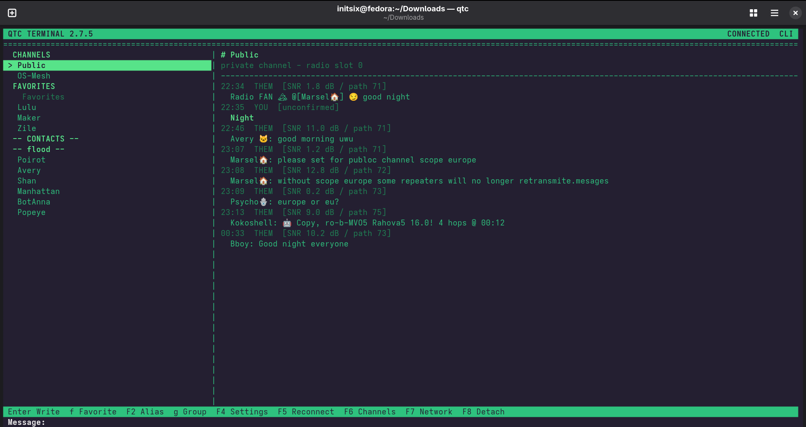

# QTC Terminal

**An old-school-cool terminal client for MeshCore messaging on Linux and macOS.**

<p align="center">
  
</p>

QTC turns a USB-connected MeshCore Companion radio into a desktop terminal messenger. It provides direct messages, channels, local history, favorites, notifications, and a persistent background connection without requiring a graphical desktop client.

QTC is local-first: your message history and settings stay on your machine, and ordinary messaging goes through your MeshCore radio.

## Quick start

### Linux

Download `qtc-linux-x86_64` from the [latest GitHub release](https://github.com/initsixdev/QTC/releases/latest), then:

```sh
chmod +x qtc-linux-x86_64
sudo install -m 0755 qtc-linux-x86_64 /usr/local/bin/qtc
qtc
```

### macOS

There is no prebuilt macOS binary, so build from source. Nothing beyond Apple's toolchain is required, because the macOS SDK already supplies SQLite 3:

```sh
xcode-select --install
make
sudo make install
qtc
```

### Choosing a radio

```sh
qtc --list-devices
qtc --device /dev/ttyACM0            # Linux
qtc --device /dev/cu.usbmodem1101    # macOS
```

Automatic detection looks for `/dev/serial/by-id/*`, `/dev/ttyACM*`, and `/dev/ttyUSB*` on Linux, and for `/dev/cu.usbmodem*`, `/dev/cu.usbserial*`, `/dev/cu.wchusbserial*`, and `/dev/cu.SLAB_USBtoUART*` on macOS. Bluetooth and debug serial ports are never offered.

macOS needs no permission step: a connected radio's `/dev/cu.*` node already belongs to the logged-in user. The matching `/dev/tty.*` node is deliberately ignored, because it blocks on carrier detect and is the wrong device for a modem-style radio. Some USB-serial bridges need their vendor driver installed before the node appears at all.

If Linux denies access to the serial device, add your user to the serial-access group used by your distribution:

```sh
sudo usermod -aG dialout "$USER"
```

Then log out completely and log back in. QTC can also print a udev rule:

```sh
qtc --print-udev-rule | sudo tee /etc/udev/rules.d/99-qtc-meshcore.rules
sudo udevadm control --reload-rules
sudo udevadm trigger
```

Unplug and reconnect the radio after installing the rule. On macOS the same command prints the device notes for that platform instead.

## Features

- Direct MeshCore messaging with local conversation history.
- Channel messaging and private-channel management.
- Join a private channel from an invitation URI, a raw 32-character key, or `Name:key`.
- Invite selected MeshCore contacts to private channels with an explicit confirmation screen.
- Contact aliases, favorites, favorite groups, unread state, and search.
- Contacts grouped by route distance, with infrastructure nodes separated from people.
- Persistent background core: detach the terminal without disconnecting the radio.
- Desktop notifications and notification sounds.
- Four built-in terminal themes: Green Phosphor, Amber CRT, Midnight BBS, and Mono TTY.
- Wrapped message history with Page Up/Page Down navigation.
- Radio controls for name, TX power, synchronization, reconnect, and advertisements.
- Zero-hop and flood self advertisements with visible feedback.
- Export your radio's MeshCore contact card to the clipboard.
- First-connect regional radio presets.
- Long UTF-8 messages are split and reassembled automatically between QTC clients.

## Main controls

| Key | Action |
|---|---|
| `Up` / `Down`, `j` / `k` | Move selection |
| `Enter` | Open the selected conversation and start typing |
| `m` | Compose in the open conversation |
| `f` | Toggle favorite |
| `F2` / `e` | Edit contact alias |
| `g` | Set favorite group |
| `/` | Search |
| `Page Up` / `Page Down` | Scroll conversation history |
| `F4` / `s` | Settings |
| `F5` | Reconnect radio |
| `F6` | Channels |
| `F7` | Network Nodes |
| `F8` / `Ctrl+C` | Detach this terminal; keep QTC running |
| `Ctrl+Q` twice | Stop QTC completely and release USB |
| `Esc` | Cancel or return |

### Channels

| Key | Action |
|---|---|
| `c` | Create private channel |
| `j` | Join from URI, raw key, or `Name:key` |
| `i` | Invite one or more contacts |
| `r` | Rotate private-channel key |
| `d` | Leave channel while keeping local history |
| `v` | Review a pending invitation |

### Settings

| Key | Action |
|---|---|
| `t` | Choose theme |
| `d` | Change radio name |
| `p` | Change TX power |
| `z` | Send zero-hop advertisement |
| `x` | Send flood advertisement |
| `c` | Copy your MeshCore contact card |
| `o` | Open regional radio presets |
| `y` | Force stored-message synchronization |
| `r` / `F5` | Reconnect radio |
| `n` | Test desktop notification |
| `a` | Test notification sound |

Additional notification, retry, display, and history options are available directly in the Settings screen.

## Background operation

QTC uses one background core per profile. The core owns the USB connection and local database while the terminal UI is only a client of that core.

This means:

- `Ctrl+C` or `F8` closes the terminal UI but keeps the radio connected.
- Messages continue to be received and stored while no terminal is attached.
- Desktop notifications and sounds can continue in the background.
- Running `qtc` again reconnects to the existing core.
- `qtc shutdown` or `Ctrl+Q` twice stops the core and releases USB.

Check the running core with:

```sh
qtc status
```

## Notifications and sound

QTC works without desktop integration. It looks for helper programs at runtime and uses the first one present, so the same build behaves correctly on any desktop. Notifications try `notify-send`, then `terminal-notifier`, then `osascript`. Sound tries `canberra-gtk-play`, then `pw-play`, then `afplay`. Clipboard export tries `wl-copy`, `xclip`, `xsel`, then `pbcopy`.

macOS ships `osascript`, `afplay`, and `pbcopy`, so nothing needs installing. `terminal-notifier` is optional and gives QTC its own notification identity instead of Script Editor's.

On Linux, install the optional helpers for your distribution.

Fedora:

```sh
sudo dnf install libnotify pipewire-utils
```

Debian or Ubuntu:

```sh
sudo apt install libnotify-bin pipewire-bin
```

Arch Linux:

```sh
sudo pacman -S libnotify pipewire-audio
```

Set `QTC_SOUND_FILE` to choose the notification sound:

```sh
export QTC_SOUND_FILE=/System/Library/Sounds/Submarine.aiff
```

## Command line

Common commands:

```sh
qtc status
qtc shutdown
qtc channel list
qtc channel create "Family"
qtc channel join "meshcore://channel/add?name=Family&secret=..."
qtc channel join "00112233445566778899aabbccddeeff"
qtc channel join "Family:00112233445566778899aabbccddeeff"
qtc channel invite "Family" "Ana"
qtc channel rotate "Family"
qtc channel leave "Family"
qtc test-notify
qtc test-sound
```

Global options such as `--profile` and `--device` may be placed before or after a command.

## Build from source

One source tree builds native executables for both platforms. Required development packages:

- C11 compiler
- GNU Make
- SQLite 3 development headers and library
- POSIX development environment

Fedora:

```sh
sudo dnf install gcc make sqlite-devel
make
make test
```

Debian or Ubuntu:

```sh
sudo apt install build-essential libsqlite3-dev
make
make test
```

macOS, using the Xcode Command Line Tools:

```sh
xcode-select --install
make
make test
```

The executable is named for the host platform:

```text
build/qtc-linux-x86_64
build/qtc-macos-arm64
```

See [BUILDING.md](BUILDING.md) for sanitizer, release-check, and packaging commands.

## Local data

QTC stores profile data in SQLite under:

```text
${XDG_DATA_HOME:-~/.local/share}/qtc-terminal/<profile>/qtc.db
```

Runtime socket and lock state live under:

```text
$XDG_RUNTIME_DIR/qtc/<profile>/
```

macOS does not define `XDG_RUNTIME_DIR`, so it uses a user-owned directory below `/tmp` instead. The socket is permission-restricted and the core verifies the connecting user's UID on both platforms.

Use `--profile` to keep independent QTC setups on the same machine.

See [PRIVACY.md](PRIVACY.md) for the privacy model.

## Long-message compatibility

Long messages use normal MeshCore text messages with a small QTC multipart envelope. QTC reassembles those parts into one logical message. Other clients that do not understand the QTC multipart format may display the individual parts separately.

## MeshCore interoperability

QTC communicates with MeshCore Companion firmware through the public MeshCore Companion Protocol. QTC is an independent project and is not an official MeshCore client.

Protocol documentation:

- https://docs.meshcore.io/companion_protocol/
- https://github.com/meshcore-dev/MeshCore/wiki/Companion-Radio-Protocol

## License

QTC is open-source software licensed under the GNU General Public License v3.0. See [LICENSE](LICENSE).
